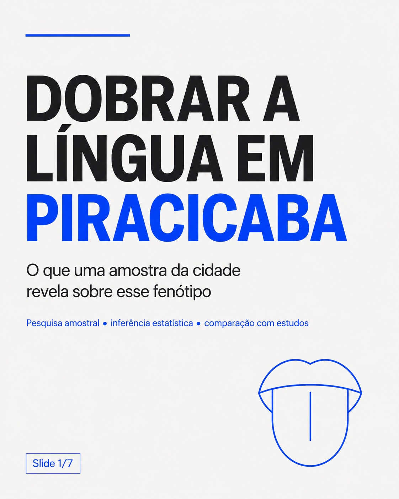
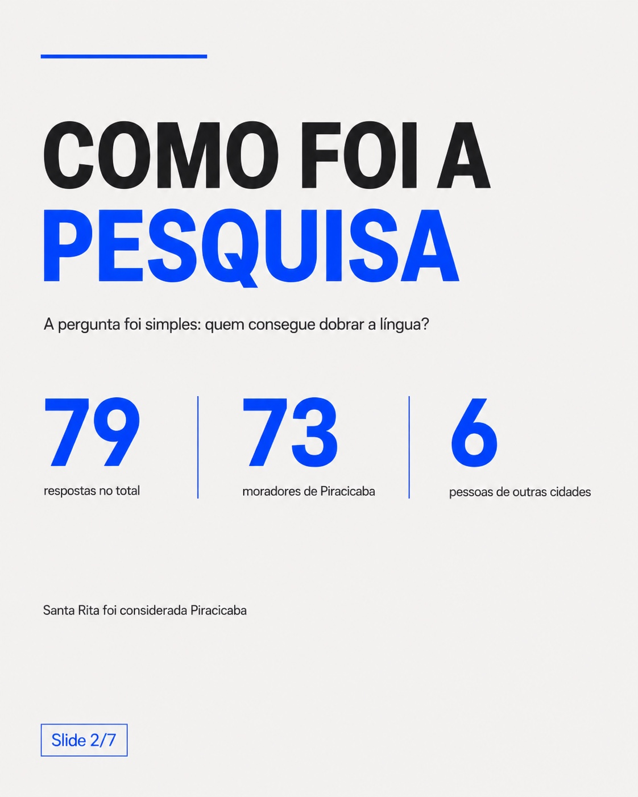
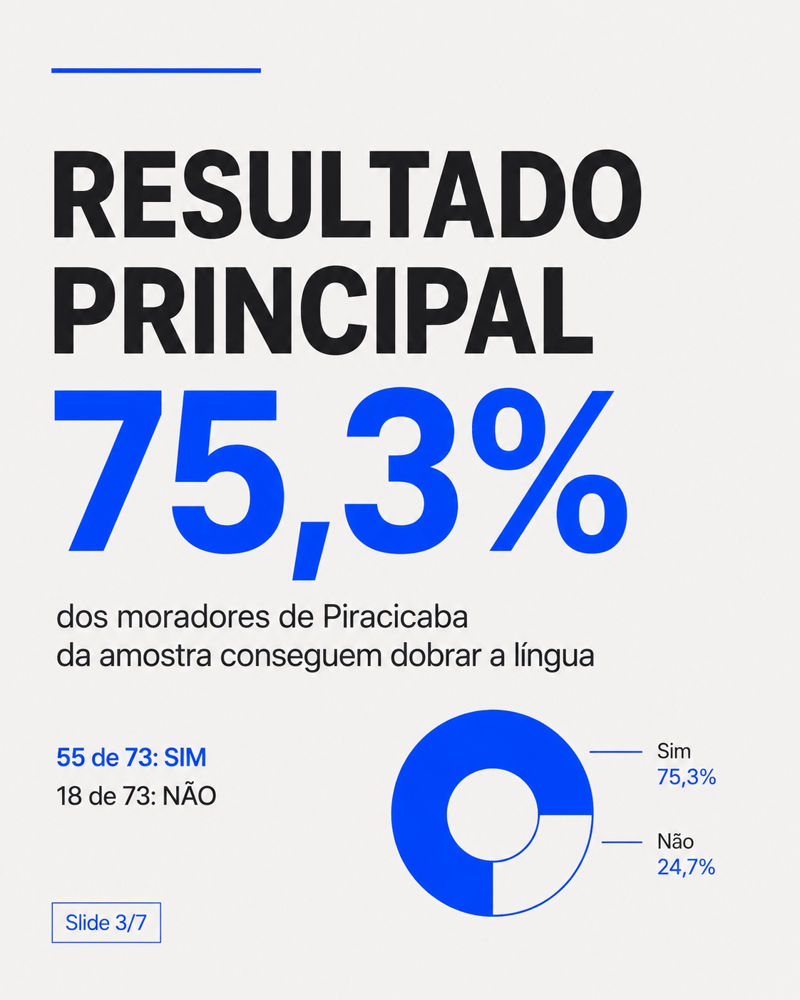
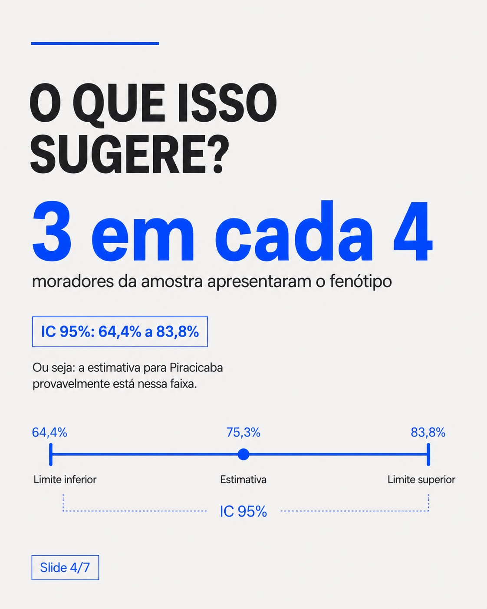
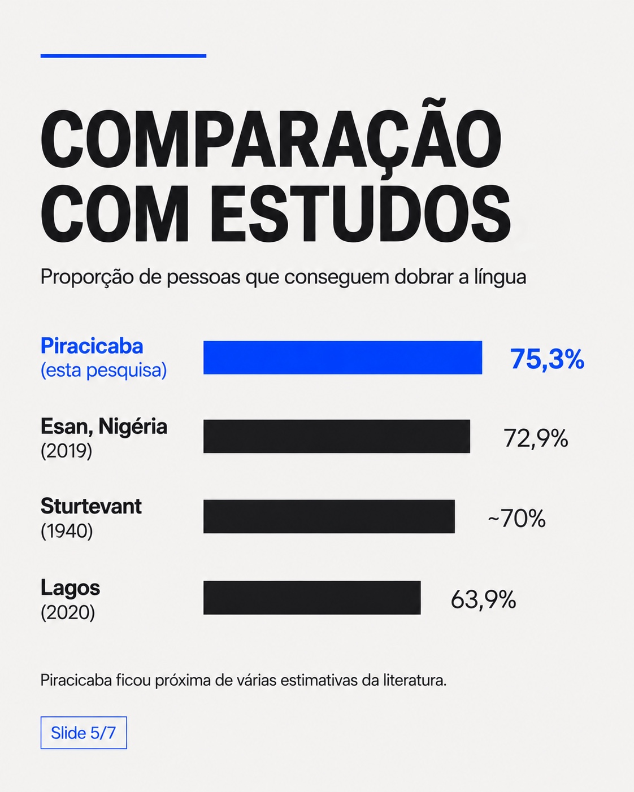
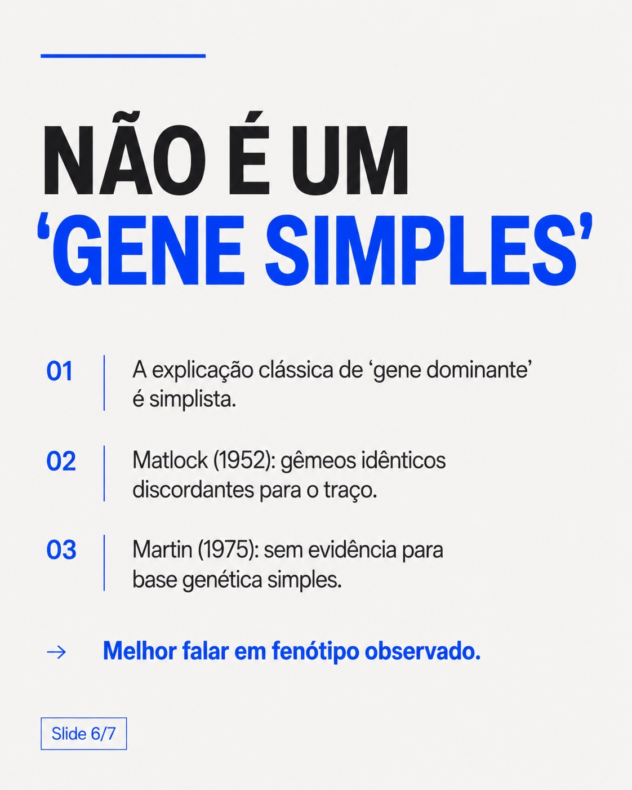
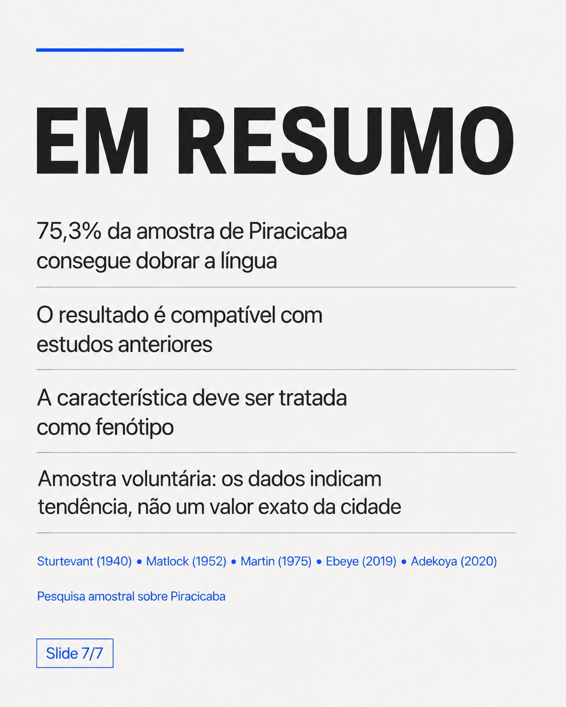

# Dobrar a Língua em Piracicaba

Uma data story local sobre a capacidade observada de dobrar/enrolar a língua em uma amostra voluntária de Piracicaba, combinando pesquisa via Google Forms, estatística descritiva, intervalo de confiança de Wilson e comparação com estudos publicados.

[English version](README.md)



## Pergunta de pesquisa

**O que uma amostra local sugere sobre a frequência do fenótipo de dobrar a língua em Piracicaba?**

A pesquisa reuniu **79 respostas**. Após normalizar a resposta `santa rita` como Piracicaba, conforme a regra usada no carrossel, **73 respondentes** foram incluídos na subamostra de Piracicaba e **6** foram tratados como moradores de outras cidades.

Entre os 73 respondentes de Piracicaba, **55 responderam “Sim”** e **18 responderam “Não”**, o que corresponde a **75,3%** e **24,7%**, respectivamente. A exportação original da pesquisa está preservada no repositório e a base estruturada reproduz as 79 linhas do arquivo fornecido.

## Principais resultados

- **79** respostas no total.
- **73** respondentes incluídos na amostra de Piracicaba.
- **55 de 73 (75,3%)** afirmaram conseguir dobrar a língua.
- **18 de 73 (24,7%)** afirmaram não conseguir.
- O **intervalo de 95% pelo método de Wilson** para a proporção observada é **64,4% a 83,8%**.
- O resultado local ficou próximo de valores encontrados em algumas amostras publicadas, como **72,9%** entre participantes Esan no sul da Nigéria (Ebeye, 2019) e **63,9%** entre universitários nigerianos (Adekoya et al., 2020).

## Nota importante de interpretação

Esta é uma **amostra voluntária e não probabilística**. Portanto, 75,3% é um resultado descritivo da subamostra observada de Piracicaba. O intervalo de Wilson quantifica a incerteza binomial em torno dessa proporção, mas **não corrige viés de seleção** nem transforma a amostra em uma amostra representativa do município.

Assim, o projeto trata o resultado como uma **estimativa da amostra / data story local**, e não como uma prevalência populacional exata de Piracicaba.

## Dobrar a língua não é um “gene simples”

A explicação escolar clássica de que dobrar a língua seria determinado por um único gene dominante é simplista. O trabalho de Sturtevant (1940) popularizou uma interpretação hereditária, mas evidências posteriores enfraqueceram um modelo genético simples. Matlock (1952) descreveu gêmeos monozigóticos discordantes para o traço, e Martin (1975) não encontrou evidência que sustentasse uma base genética simples.

Por isso, o carrossel prefere falar em **fenótipo observado**, sem tratar a característica como um traço mendeliano de gene único.

## Carrossel

As sete imagens abaixo são as artes originais fornecidas, armazenadas sem alterações visuais.

### 1. Pergunta de pesquisa


### 2. Como foi a pesquisa


### 3. Resultado principal


### 4. Intervalo de confiança e interpretação


### 5. Comparação com estudos


### 6. Por que não é um “gene simples”


### 7. Resumo


## Estrutura do repositório

```text
assets/carousel/                       sete imagens originais do carrossel
assets/carousel/SHA256SUMS.txt         hashes das imagens fornecidas
data/respostas_pesquisa.csv            respostas em formato tabular
data/respostas_pesquisa.xlsx           planilha com respostas + resumo
data/metricas_resumo.csv                métricas principais calculadas
data/literature_comparison.csv         valores exibidos na comparação
data/source/pesquisa_dobra_lingua_respostas.pdf
                                       exportação original fornecida
docs/methodology.md
docs/sources.md
docs/data-validation.md
src/validate_metrics.py
```

## Reprodutibilidade

Execute:

```bash
python src/validate_metrics.py
```

O script recalcula os totais, a proporção de 75,3%, o intervalo de Wilson de 95% e valida a regra de normalização aplicada à resposta `santa rita`.

## Formulário de coleta

URL pública do formulário:

https://docs.google.com/forms/d/1uMHUzyV2TosXmxHaTtNSuZ7NwvCJYoGb74adRUqh9d4/viewform

## Fontes

A documentação reúne a exportação da pesquisa e as referências científicas usadas no carrossel. Veja [`docs/sources.md`](docs/sources.md).

## Autor

Gabriel Delvaje — análise de dados e data storytelling.
